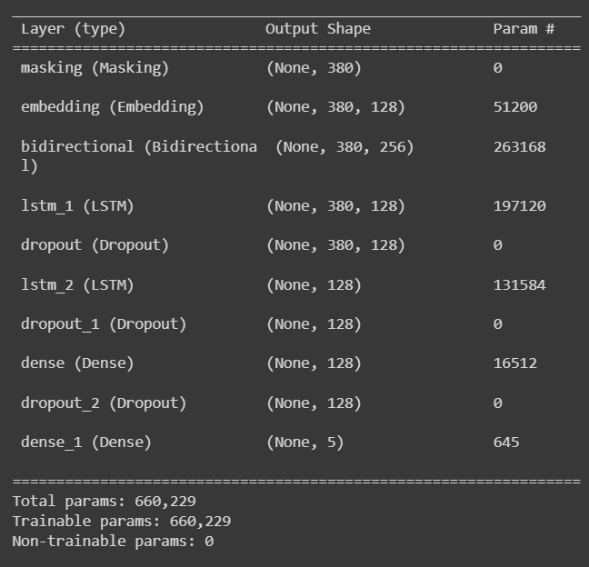
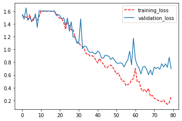
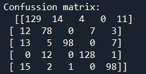
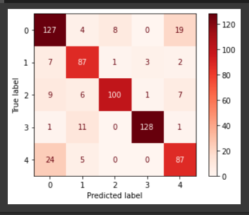

# NLP_Article_Analysis 
Text article dataset is sorted into 5 categories namely Sport, Tech, Business, Entertainment and Politics using Natural Language Processing Approach.

# PROBLEM STATEMENT
Provided text documents with 5 categories, can we categorize unseen in articles into 5 categories?

# STEP 1 - Data Loading

`df = pd.read_csv(CSV_URL)` 

# STEP 2 - Data Inspection

`df.head(10)
df.tail(10)` #There are 2225 dataset in here

Create bar plot for category data
`sns.countplot(df.category)` 


Get the unique target variables and inspect the anomalies, duplicates and missing values

```
df['category'].unique()  
#There are 5 category in this :['tech', 'business', 'sport', 'entertainment', 'politics']

#Check for NaN or missing values
df.isna().sum()` # no missing values found

#Check for duplicated values
df.duplicated().sum() #There are 99 duplicated datas 
df[df.duplicated()] #Extracting the duplicated data 
```

# STEP 3 - Data Cleaning

#1) Remove all the duplicated data
```
df= df.drop_duplicates() #Remove 99duplicates, left 2126 datas
df.duplicated().sum() # no more duplicate values

#Extract Features with 5 categories

category =  df['category'].values
text=df['text'].values 
```

#2) Remove numerics inside text file using RegEX

```
for index, t in enumerate(text):
    text[index] = re.sub('.*?',' ',t)
    text[index] =re.sub('[^a-zA-Z]',' ',t).lower().split()

#^ means NOT alphabet
#Substituting that is not a-z and A-Z  will be replaced with a space
#Hence, all numeric will be removed so now we have changed every word into lower case and splitted them into a list of words

text[10] #Check for all the words has been split into a list of words with lower case
```

# STEP 4 - Features Selection
Everything is selected from features since this is NLP data

# STEP 5 - Preprocessing

#1) Use Tokenization to make each word return with index

```
vocab_size = 400
OOV_token = 'OOV'

tokenizer= Tokenizer(num_words=vocab_size, oov_token=OOV_token)
tokenizer.fit_on_texts(text) #to learn all the words
word_index = tokenizer.word_index

# Encode all into numbers to fit the text
train_sequences = tokenizer.texts_to_sequences(text) #to convert into numbers
```

Get the average number of text inside a row for padding
```
#Test to see the number of words from one category of text
#len(train_sequences[0]) #744
#len(train_sequences[1]) #296
#len(train_sequences[500])#600
#len(train_sequences[1500]) #306

length_of_text=[len(i) for i in train_sequences]
np.median(length_of_text) #334 median value of number of text
np.mean(length_of_text) #387 mean value of number of text
np.max(length_of_text) #4469 max value of text`

#Pick the reasonable padding value
#Median is chosen for this padding values
#Padding is to make each length to be similar
```
#2) Padding and Truncating
```
max_len=380
padded_text = pad_sequences(train_sequences, 
                            maxlen=max_len,
                            padding='post',
                            truncating = 'post')  # so now all rows are in equal length
 ```


#4) One Hot Encoding for the Target - category
```
ohe = OneHotEncoder(sparse=False)
category = ohe.fit_transform(np.expand_dims(category,axis=-1)) 
```

#5) Train-test-split because this is a classification problem

```
X_train,X_test,y_train,y_test = train_test_split(padded_text,
                                                 category,
                                                 test_size=0.3,
                                                 random_state=123)
X_train= np.expand_dims(X_train, axis=-1)
X_test= np.expand_dims(X_test, axis=-1)`
```

# STEP 6 - Model Development
USE LSTM layers, dropout, dense, input, embedding, bidirectional in module_for_article_analysis()

```
nb_features = 380
output_node=len(y_train[1]) 
model = Model_Creation().NLP_model(nb_features, output_node,vocab_size, 
                                   embedding_dim = 128, drop_rate=0.2, 
                                   num_node= 128 )`
```
#Callbacks

`tensorboard_callback=TensorBoard(log_dir=LOG_FOLDER_PATH)`

#Compile model

`model.compile(optimizer='adam', loss='categorical_crossentropy', metrics ='acc') 
#since its a classifier problem, categorical crossentropy is chosen`

# STEP 7) MODEL ANALYSIS

Visualising Natural Language Processing model

`plot_model(model,show_shapes=True, show_layer_names=(True))`


Total Parameters: 660,229




Model Fitting and Testing

`hist= model.fit(X_train, y_train, batch_size=20, epochs=80, 
                validation_data=(X_test, y_test),
                callbacks= tensorboard_callback)`
                
#0.27% is achieved on 1st training by only using 2 LSTM layer
#after bidirectional still not improve at #0.29

Plot fitted model evaluation using history in module_for_article_analysis()

`Model_Analysis().plot_analysis(hist) `




Plot hist using Tensorboard log directory


#Model is showing overfitting when reaching epochs 50 onwards

# STEP 7 - Model Evaluation

Evaluate model by plotting graph using ConfusionMatrixDisplay and generate Classification Report in module_for_article_Analysis()

`Model_Analysis().Model_Evaluation(model,X_test,y_test)`

Confusion Matrix score



Confusion Matrix plot



Classification Report


Accuracy_score


# Step 8) Model Saving

```
#Save NLP model
model.save(MODEL_SAVE_PATH)

#save tokenizer
token_json = tokenizer.to_json()
with open(TOKENIZER_PATH,'w') as file:
    json.dump(token_json,file) # token_json is our dictionary now

#save One Hot Encoding model
with open(OHE_PATH,'wb') as file:
    pickle.dump(ohe,file)
```

# DISCUSSION
1) Model accuracy by only using 2 LSTM layer will only achieve 29% accuracy
2) Model accuracy using 1 embedding layer increases performance very minimally
3) By Adding masking, epoch increases the accuracy up to 82%
4) The model achieved high with average 83% F1-score and accuracy score of 83%
5) Model evaluated with test data has 83% accuracy 
6) when put earlystopping the model reduces accuracy to 29% only
7) To further increase the performance of NLP model: 
    #1) Increasing number of epochs, 
    #2) Increase number of samples
    #3) Change dropout rate value
    #4) Add word2vec to remove stop words from dataset

